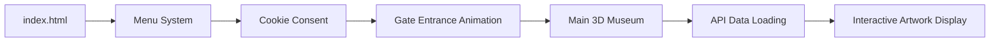

# Virtueel Queer Museum 

## Overview
The Virtueel Queer Museum is a 3D virtual art museum built for web browsers, showcasing queer artwork in an immersive FPS-style environment. Users can navigate through gallery rooms, view artwork with audio guides, read detailed descriptions, and leave reviews in a guestbook. 

## Credits
Li Hong Chen
E.V.A
Robin te Beek
Joaquin De Boer
Lena Kushniruk
Jay Jairam

## Tech Stack

| Technology | Purpose |
|------------|---------|
| **Three.js** | 3D rendering engine for the museum environment |
| **nipplejs** | Virtual joystick for mobile navigation controls  |
| **Vanilla JavaScript** | Core application logic |
| **HTML/CSS**  | UI components and menu system |
| **REST API**  | Backend at `http://10.120.5.132:8000` for artwork data

## Key Features

- **3D Navigation**: FPS-style movement with WASD/arrow keys and mouse look, or virtual joystick on mobile  
- **Audio Guides**: Interactive audio buttons for each artwork with play/pause functionality 
- **Artwork Descriptions**: "Lees meer" (read more) buttons showing detailed artwork information
- **Guestbook System**: Review popup for visitors to leave feedback  
- **Cookie Consent**: GDPR-compliant cookie consent system 
- **Responsive Design**: Mobile-optimized with touch controls and adaptive UI 

## How It Works

### Entry Points
- **`index.html`**: Main entry with light-themed menu system and entrance animation
- **`test.html`**: Development entry for direct testing without menu overhead 

### Application Flow

### Core Components

1. **Menu System** (`menu/menu.js`): Handles the light-themed menu, cookie consent, and the dark gate entrance animation that transitions users into the 3D environment

2. **Main 3D Environment** (`js/Mainroom.js`): Creates the pentagonal central hall, gallery rooms, lighting, and handles user movement/camera controls

3. **API Integration** (`loadKunstwerkenFromAPI`): Fetches artwork metadata, images, and audio paths from the backend API, then dynamically creates 3D artwork meshes with appropriate scaling and positioning

4. **Audio System** (`function/audio.js`): Manages 3D spatial audio, creates speaker icon textures, and handles audio playback with play/pause state management

5. **Artwork Display** (`function/billboard.js`): Handles texture loading, aspect ratio calculation, and creates framed paintings with proper materials 

## Local Development

The project uses Live Server on port 5501 for local development. Simply open `index.html` or `test.html` through a local web server to run the application.

## Notes
- PointerLock API is used for FPS-style mouse control on desktop 
- The backend API endpoint is currently hardcoded to `http://10.120.5.132:8000` which is our current server

